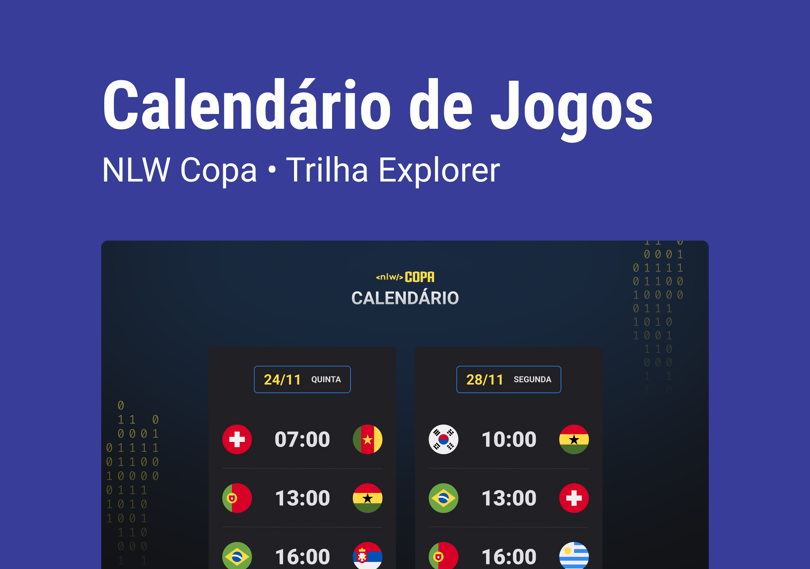

<h1 align="center"> NLW #10 Copa </h1>

Evento exclusivo e gratuito, promovido pela Rocketseat para ensino de tecnologias WEB.

  <a href="#-tecnologias">Tecnologias</a>&nbsp;&nbsp;&nbsp;|&nbsp;&nbsp;&nbsp;
  <a href="#-projeto">Projeto</a>&nbsp;&nbsp;&nbsp;|&nbsp;&nbsp;&nbsp;
  <a href="#-layout">Layout</a>&nbsp;&nbsp;&nbsp;|&nbsp;&nbsp;&nbsp;
  <a href="#-licença">Licença</a>

 

  

## 🚀 Tecnologias

Esse projeto foi desenvolvido com as seguintes tecnologias:

- HTML e CSS
- JavaScript
- Git e GitHub

## 💻 Projeto

O Calendário da Copa é um projeto que mostra os jogos da Copa de 2022.

## 📐 Layout

Você pode visualizar o layout do projeto através [desse link](https://www.figma.com/community/file/1169028052212317700). É necessário ter conta no [Figma](https://figma.com) para acessá-lo.

## ✒️ Licença

Esse projeto está sob a licença MIT.

---

Feito com ♥ por [Carlos André.](https://github.com/andresoftdev)
